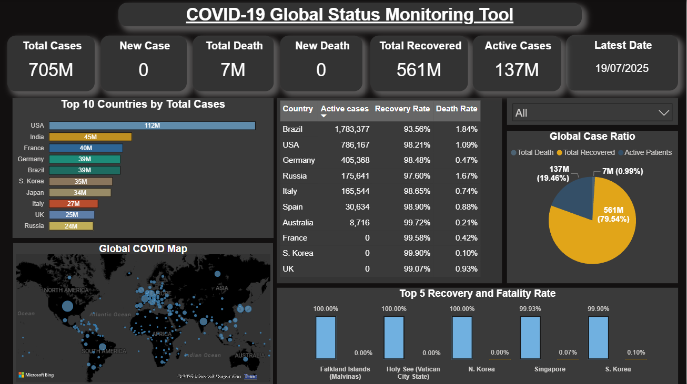

# 📘 COVID-19 Global Monitoring Dashboard


---

## 🧾 1. Project Overview

This project provides a **real-time automated COVID-19 tracking system**. It leverages public health data APIs and automates the full ETL workflow—from extraction to visualization—offering an interactive Power BI dashboard for global monitoring.

- **API**: [disease.sh](https://disease.sh/)
- **ETL**: Python + SQLite + MS Excel
- **Visualization**: Microsoft Power BI
- **Automation**: Windows Task Scheduler with `.bat` file



---

## ❓ 2. Business Questions Addressed

- Which countries are the most and least affected by COVID-19?
- What is the global recovery rate vs. death rate?
- How is the active vs. recovered vs. deceased case distribution?
- What are today's new cases across the world?
- How do outbreak patterns evolve over time?

---

## 📊 3. Data Analysis

### ✅ Dataset Fields:
- `country`, `cases`, `todayCases`, `deaths`, `todayDeaths`
- `recovered`, `todayRecovered`, `active`, `critical`, `population`
- `fetch_date` (auto-refreshed daily)

### 📡 Data Source:
- API Endpoint: `https://disease.sh/v3/covid-19/countries`
- Refreshed and logged **daily** using Python → SQLite → Excel

---

## 📈 4. Visualizations (Power BI)

| Component           | Description                                                                 |
|--------------------|-----------------------------------------------------------------------------|
| **KPI Cards**       | Global stats: Total Cases, Deaths, Recovered, Population, Last Updated      |
| **Line Chart**      | Daily new cases trend across all countries                                  |
| **Bar Chart**       | Top 10 countries by total COVID cases                                       |
| **Clustered Bars**  | Death Rate vs. Recovery Rate by Country                                     |
| **Pie Chart**       | Proportion of Active, Recovered, and Deaths globally                        |
| **Filled Map**      | World map colored by total cases                                            |
| **Slicers**         | Filters by `Country`, `Population`, and `Date`                              |

📁 Power BI File:  
[🔗 Visualisation/Visualiastion of covid data.pbix](./Visualisation/Visualiastion%20of%20covid%20data.pbix)

---

## 🧠 5. Key Insights

- U.S., India, Brazil have the highest case volume.
- Many countries show high recovery rates (>80%).
- Smaller countries may have higher per capita impact.
- Map and pie charts effectively convey global distribution.
- Trends help anticipate outbreak waves and effectiveness of control measures.

---

## ⚙️ 6. Tech Stack

| Tool             | Purpose                                               |
|------------------|--------------------------------------------------------|
| Python           | ETL, API integration, data cleaning                   |
| Pandas           | Data wrangling and transformation                     |
| SQLite           | Lightweight DB for historical data tracking           |
| Power BI         | Interactive dashboards & stakeholder reports          |
| Windows Scheduler| Automate daily script execution                       |

---

## 🛠️ 7. Automation & Maintenance

- 🧠 **Script**:  
  [Notebook and scripts/covid_auto_fetch.py](./Notebook%20and%20scripts/covid_auto_fetch.py)

- ⚙️ **Batch File**:  
  [Notebook and scripts/covid_auto_fetch_script.bat](./Notebook%20and%20scripts/covid_auto_fetch_script.bat)

- 📅 **Scheduled With**:  
  Windows Task Scheduler (runs script every day automatically)

- 📂 **Daily Output**:
  - [Live covid19 dataset/covid_data.db](./Live%20covid19%20dataset/covid_data.db)
  - [Live covid19 dataset/covid_data_exported.xlsx](./Live%20covid19%20dataset/covid_data_exported.xlsx)
  - [Log files/log.txt](./Log%20files/log.txt)
  - [Log files/error_log.txt](./Log%20files/error_log.txt)

✅ The pipeline ensures the **Excel** and **SQLite DB** are updated daily with minimal manual effort.

---

## 📁 8. Project Structure

```

📦 Live-Covid19-Project
│
├── 📂 Live covid19 dataset
│   ├── covid\_data.db
│   └── covid\_data\_exported.xlsx
│
├── 📂 Log files
│   ├── log.txt
│   └── error\_log.txt
│
├── 📂 Notebook and scripts
│   ├── covid\_auto\_fetch.py
│   ├── covid\_auto\_fetch\_script.bat
│   ├── covid\_data.ipynb
│   └── EDA covid data.ipynb
│
├── 📂 Visualisation
│   └── Visualiastion of covid data.pbix
│
├── 📂 Report
│   └── COVID19\_Global\_Dashboard\_Report.pdf
│
├── 📄 Dashboard.png
└── 📄 README.md

```

---

## 📌 9. Recommendations

- Add **moving averages** for smoother trends.
- Include **cases per million** population for fairness.
- Add **conditional formatting** in KPIs (e.g., red for rising cases).
- Use **Power BI Service** to publish interactive dashboards online.
- Introduce **alerts** when cases spike or threshold is crossed.

---

## 🏁 10. Conclusion

This project is a strong showcase of full-stack data skills—ideal for data analyst and BI developer roles:

- ✅ API Integration & ETL
- ✅ Real-time data pipelines
- ✅ SQLite + Excel syncing
- ✅ Power BI dashboarding
- ✅ End-to-end automation

---

## 🔗 Connect with Me

- 🌐 [GitHub Profile](https://github.com/Steffin12-git)
- 💼 [LinkedIn](https://www.linkedin.com/in/steffin-thomas-b85549260)
- 👨‍💻 [HackerRank](https://www.hackerrank.com/profile/steffinthomas12)

> 💬 *Feel free to fork this repo or reach out for collaborations or suggestions!*
```
